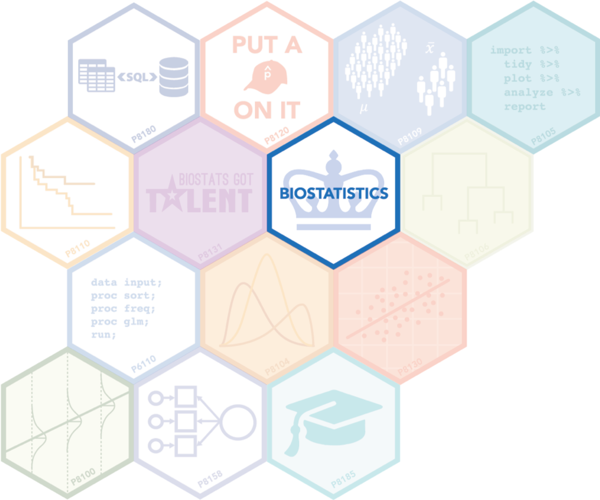

---
title:
output:
  html_document:
    df_print: paged
---

<h1 style="text-align:center">Welcome to the Columbia Biostatistics Computing Club!</h1>

<p>

 The Columbia Biostatistics Computing Club hosts casual seminars focusing on computational topics often encountered in biostatistics research. These tutorials provide hands-on learning at a variety of skill levels, with some focused on bringing new students up to speed and others addressing more advanced problems. Our overarching goal is to impart good programming practices that encourage collaborative reproducible research!

This year's organizers are [Angel Garcia de la Garza](https://www.angelgarciadelagarza.com), Muhire Kwizera, Rebecca Silva, Charly Fowler, Bryan Bunning, Gavin Ko and Amy Pitts. Angel and Muhire are fourth-year Ph.D students, Charly and Rebecca are 2nd-year Ph.D students and Amy is a first-year Ph.D student. Gavin and Bryan are second-year Master's students on the  Theory and Methods track. The group is run with the help of faculty advisor [Christine Mauro](http://christinemauro.com/). A schedule for the upcoming  events is below and will be regularly updated. Please fill out this [survey](https://docs.google.com/forms/d/e/1FAIpQLSdw-LEJW3qn_nybZ2AoVvonoSkK_XeqJhnUNSZzK769rkzgGQ/viewform) to let us know what topics you are most interested in. For other inquiries, you can contact cbp2128@columbia.edu.

</p>

```{r, echo = FALSE, message = FALSE, warning = FALSE }
library(tidyverse)
library(knitr)
tib = tibble(
  `Topic` = c(
    "Panel: Best practices as a graduate student", 
    "Introduction To LaTeX", 
    "SQL with Career China Club", 
    "GGplot packages",
    "Python Tutorial"),
  `Date` = c(
    "September 16, 2020; 11:30 - 12:30pm", 
    "September 30, 2020; 11:30 - 12:30pm", 
    "October 14, 2020; 11:30 - 12:30pm", 
    "November 13, 2020; 11:30 - 12:30pm", 
    "December 9, 2020; 11:30 - 12:30pm")
  ,
  `Location` = c(
    "Zoom",
    "Zoom",
    "Zoom",
    "Zoom",
    "Zoom")
)
kable(tib)
```

Course Hex Stickers designed by <a href="https://www.behance.net/anjilean">Anjile An</a>