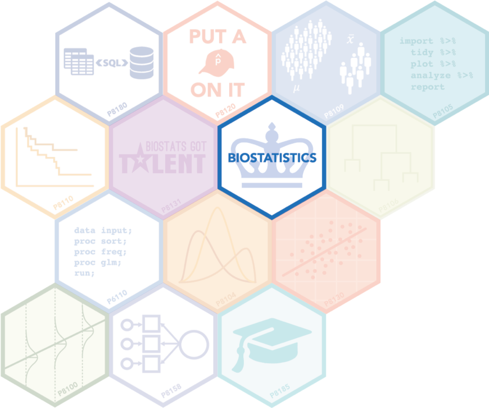

---
title:
output:
  html_document:
    df_print: paged
---

<h1 style="text-align:center">Welcome to the Columbia Biostatistics Computing Club!</h1>

<p>

 The Columbia Biostatistics Computing Club hosts casual seminars focusing on computational topics often encountered in biostatistics research. These tutorials provide hands-on learning at a variety of skill levels, with some focused on bringing new students up to speed and others addressing more advanced problems. Our overarching goal is to impart good programming practices that encourage collaborative reproducible research!

This year's organizers are Safiya Sirota, Guadalupe Antonio Lopez, Gustavo Garcia-Franceschini and Kate Colvin. In the doctoral program, Safiya is in her fifth year, while Guadalupe and Gustavo are both in their third year, and Kate is in her second year. The group is run with the help of faculty advisor [Christine Mauro](http://christinemauro.com/). A schedule for the upcoming  events is below and will be regularly updated. Please fill out this [survey](https://docs.google.com/forms/d/e/1FAIpQLSdH4v0oPvEYLz2jfXFMT0n13YOGaqf4E3fR-2D-VHTaTuc2Kg/viewform) to let us know what topics you are most interested in.

</p>


```{r, echo = FALSE, message = FALSE, warning = FALSE }
library(tidyverse)
library(knitr)
tib = tibble(
  `Topics` = c(
    "Optimization Modeling in Python",
    "Intro to Beamer"),
  `Date` = c(
    "February 25, 2026 (Wednesday); 11:45 am - 12:45 PM", 
     "TBD")
  ,
  `Location` = c(
    "HSC LL 205",
    "TBD")
)
kable(tib)
```

Course Hex Stickers designed by <a href="https://www.behance.net/anjilean">Anjile An</a>